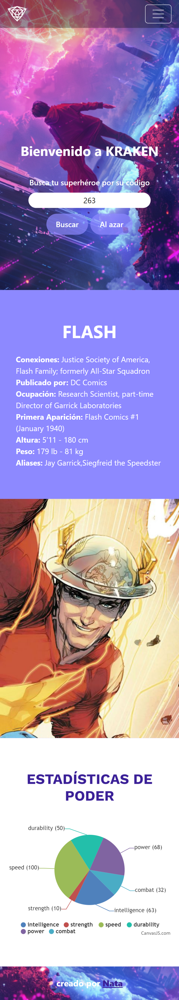

# Prueba - Fundamentos de programación en JavaScript

## Construido con

- [Midjourney](https://www.midjourney.com/jobs/a513b0c5-a57c-4173-9b5c-197aae411f9d)
- [SuperHero API](https://www.superheroapi.com/)
- [CanvasJS](https://canvasjs.com/)
- Semantic HTML5 markup
- CSS custom properties
- Flexbox
- JavaScript
- Método Mobile first 
- Creatividad y cariño 💖

## Desafío

La revista semanal SuperHero Chile, se encuentra en plena fase de masificación mediante medios digitales, por lo tanto, se diseñó un plan para atraer más clientes y así aumentar el tráfico en su página web.
En base a lo anterior, usted ha sido contratado para crear una aplicación dinámica que permita a los usuarios buscar un superhéroe y visualizar información referente al personaje buscado.

Ahora bien, para obtener la información necesaria de los Superhéroes se deberá consultar a la API denominada “SuperHero API”, la cual, se encuentra disponible en https://www.superheroapi.com/. Esta API en particular requiere de una clave o access-token, que se entrega al iniciar sesión con una cuenta de Facebook. Recuerda leer la documentación disponible en la API y revisar el material llamado Apoyo Prueba - Encuentra tu SuperHero.

